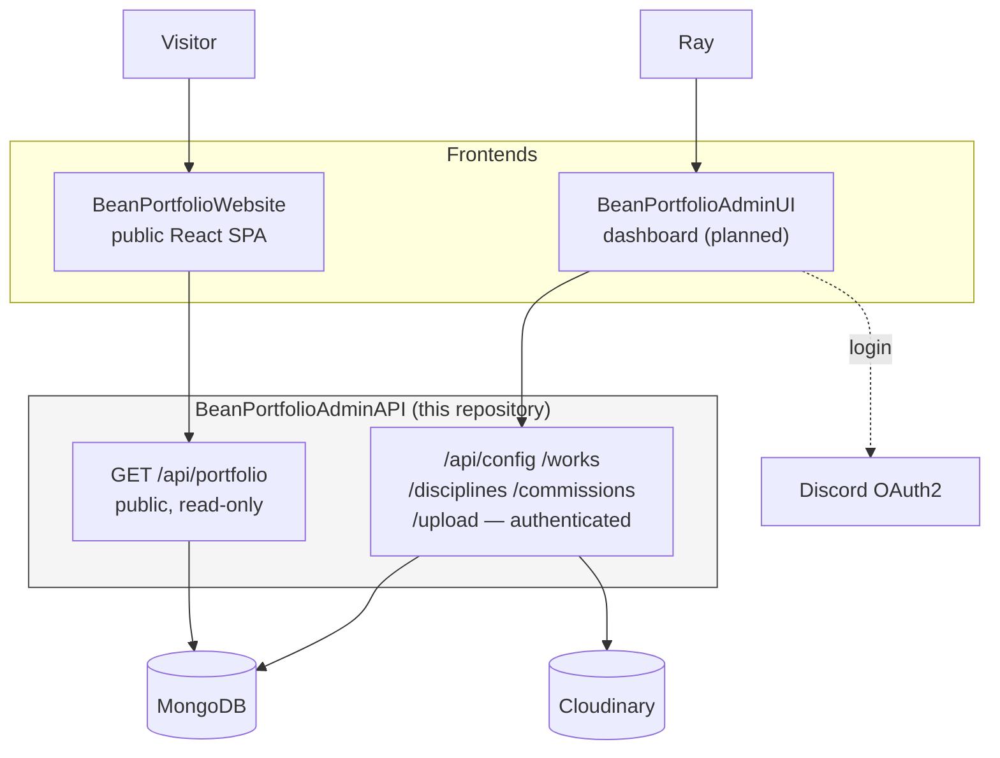
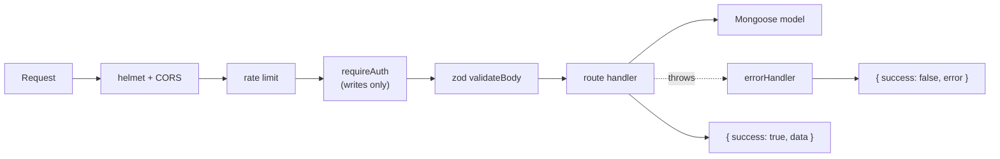
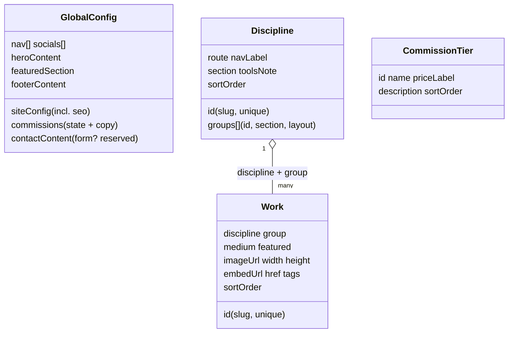
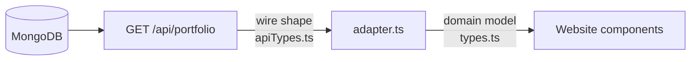
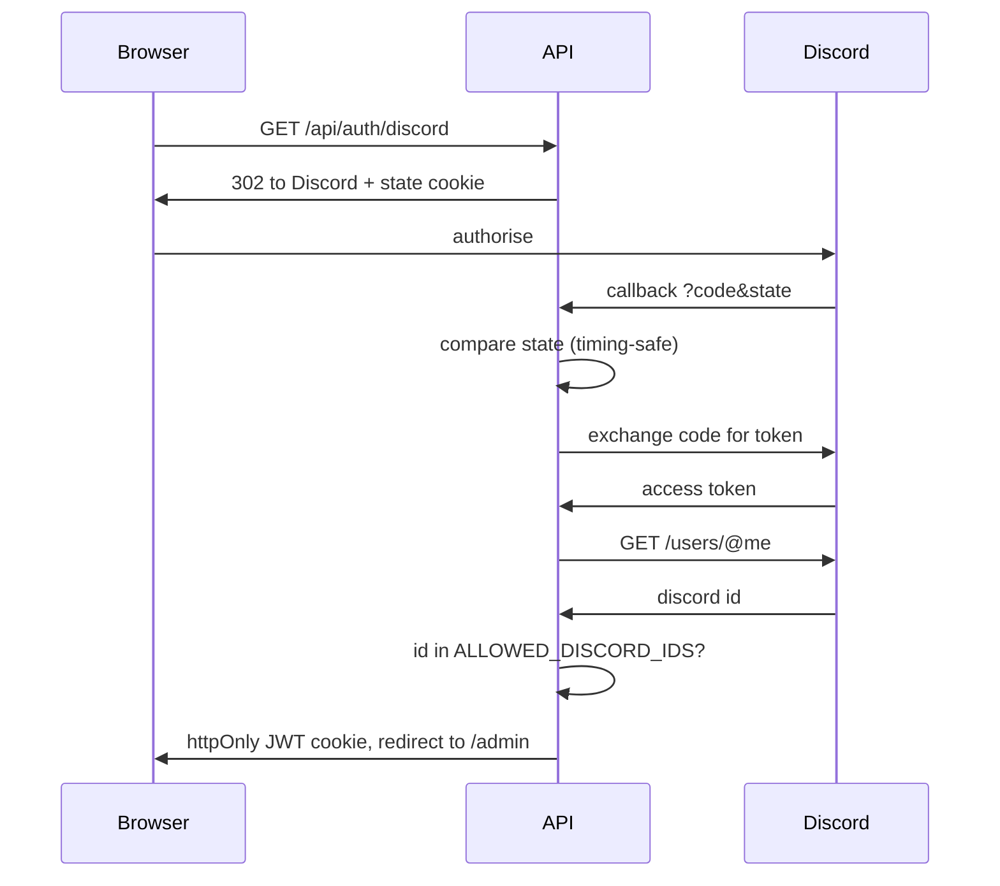
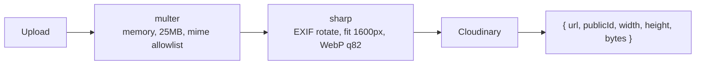

# BeanPortfolioAdminAPI

The content API behind [Raybean's portfolio](https://portfolio.raybean.cc). It
serves the entire public site from one endpoint, and exposes an authenticated
CRUD surface for the admin dashboard to edit that content.

- **Stack:** Node 20 + Express 5 + TypeScript + MongoDB (Mongoose) + Cloudinary
- **Auth:** Discord OAuth2, allowlisted, JWT in an httpOnly cookie

---

## Table of Contents

- [Overview](#overview)
- [Getting Started](#getting-started)
- [Architecture](#architecture)
- [Data Model](#data-model)
- [API Reference](#api-reference)
- [The Contract](#the-contract)
- [Authentication](#authentication)
- [Image Uploads](#image-uploads)
- [Security](#security)
- [Testing](#testing)
- [Deployment](#deployment)
- [Roadmap](#roadmap)

---

## Overview

This service is one of four in the portfolio system. It is the content source
the public site switches to when `VITE_PORTFOLIO_API_URL` is set.



Two audiences, two surfaces:

| Surface | Who | Auth | Shape |
| --- | --- | --- | --- |
| `GET /api/portfolio` | The public website | None | One aggregate document — the whole site |
| Everything else | The admin dashboard | Required | Per-collection CRUD |

---

## Getting Started

Requires Node 20+ and a MongoDB connection string.

```bash
npm install
cp .env.example .env     # fill in the values
npm run seed             # load the current site content into the database
npm run dev              # http://localhost:5000
```

| Script | Purpose |
| --- | --- |
| `npm run dev` | Watch-mode dev server (tsx) |
| `npm run build` | Type-check and compile to `dist/` |
| `npm start` | Run the compiled server |
| `npm run seed` | Populate the database (add `--force` to wipe and reseed) |
| `npm test` | Run the test suite |
| `npm run test:coverage` | Tests with a coverage report |
| `npm run lint` | ESLint |
| `npm run typecheck` | Types only, no emit |

### Environment

| Variable | Required | Purpose |
| --- | --- | --- |
| `PORT` | no (5000) | Listen port |
| `NODE_ENV` | no | `development` \| `production` \| `test` |
| `MONGO_URI` | **yes** | MongoDB connection string |
| `JWT_SECRET` | **yes** | Session signing key; must be 32+ chars in production |
| `DISCORD_CLIENT_ID` | **yes** | Discord OAuth app |
| `DISCORD_CLIENT_SECRET` | **yes** | Discord OAuth app |
| `DISCORD_REDIRECT_URI` | **yes** | Must match the Discord app exactly |
| `ALLOWED_DISCORD_IDS` | **yes** | Comma-separated Discord user IDs permitted to sign in |
| `CLOUDINARY_CLOUD_NAME` | **yes** | Image hosting |
| `CLOUDINARY_API_KEY` | **yes** | Image hosting |
| `CLOUDINARY_API_SECRET` | **yes** | Image hosting |
| `CLOUDINARY_FOLDER` | no | Upload folder (default `bean-portfolio`) |
| `CLIENT_URL` | no | Admin UI origin; OAuth redirects back here |
| `ALLOWED_ORIGINS` | no | Comma-separated CORS allowlist (defaults to `CLIENT_URL`) |

Missing required variables throw at startup rather than failing on the first
request.

---

## Architecture

```
src/
├── server.ts            # Bootstrap: validate env, connect, listen, graceful shutdown
├── app.ts               # Express wiring: security, CORS, routes, error handler
├── seed.ts              # Loads seedData.json (the live site's content)
├── seedData.json        # Generated from BeanPortfolioWebsite's portfolio.ts
├── config/              # env, db, cloudinary
├── middleware/          # auth, errorHandler, validate, upload, rateLimit
├── models/              # Mongoose schemas
├── routes/              # One file per resource + shared crudRouter + validators
├── types/               # Wire types mirroring the website's contract
└── utils/               # errors, logger
```

Request flow:



Every response uses one envelope, success or failure:

```jsonc
{ "success": true,  "data": { } }
{ "success": false, "error": { "code": "NOT_FOUND", "message": "Work not found" } }
```

---

## Data Model



| Collection | Cardinality | Notes |
| --- | --- | --- |
| `globalconfig` | Singleton | Everything that is not a list. Edited with `PATCH`. |
| `disciplines` | 3 | Graphic design, illustration, video. Declares each page's groups and their layouts. |
| `works` | Many | **Flat.** `discipline` + `group` place a work; `featured` surfaces it on the home page; `sortOrder` is what drag-to-reorder writes. |
| `commissiontiers` | Many | Empty while commissions are closed. |

Works are deliberately flat rather than nested under disciplines: grouping is a
query, so reordering and re-grouping never require a schema migration.

Resources are addressed by their **slug `id`**, not their Mongo `_id`
(`GET /api/works/vacant-rhapsody`). The slug is what the website and admin
already reference, and it survives a reseed.

---

## API Reference

All routes are prefixed `/api`. Authenticated routes require a valid session
cookie; public routes take none.

| Method | Route | Auth | Description |
| --- | --- | --- | --- |
| `GET` | `/health` | – | Liveness probe |
| `GET` | `/portfolio` | – | **The whole site in one document.** What the website reads. |
| `GET` | `/auth/discord` | – | Begin OAuth (redirects to Discord) |
| `GET` | `/auth/discord/callback` | – | OAuth return; issues the session cookie |
| `GET` | `/auth/me` | ✓ | Current admin user |
| `POST` | `/auth/logout` | – | Clear the session cookie |
| `GET` | `/config` | – | The singleton config document |
| `PATCH` | `/config` | ✓ | Merge-update one or more config slices |
| `GET` | `/works` | – | All works, ordered |
| `GET` | `/works/:slug` | – | One work |
| `POST` | `/works` | ✓ | Create |
| `PUT` | `/works/sort` | ✓ | Bulk reorder |
| `PUT` | `/works/:slug` | ✓ | Update |
| `DELETE` | `/works/:slug` | ✓ | Delete |
| `POST` | `/upload` | ✓ | Optimise and store an image |

`/disciplines` and `/commissions` expose the same six CRUD routes as `/works`.

**Reordering** — one request for a whole drag-and-drop result:

```http
PUT /api/works/sort
{ "items": [ { "id": "vacant-rhapsody", "sortOrder": 0 },
             { "id": "foxglove",        "sortOrder": 1 } ] }
```

**Config is patched, not replaced** — the dashboard edits one panel at a time
and never has to resend the whole document to change one string:

```http
PATCH /api/config
{ "commissions": { "section": { "title": "commissions" }, "isOpen": true,
                   "heading": "commissions are open!", "body": ["..."] } }
```

---

## The Contract

`GET /api/portfolio` is a contract, not just an endpoint. Its shape is defined by
`src/content/apiTypes.ts` in **BeanPortfolioWebsite**, whose `adapter.ts` maps it
onto the site's domain model.



Consequences worth knowing:

- **Dropping a field here silently degrades the site.** The adapter reads what it
  is given; a missing `width`/`height` reintroduces squashed portraits, a missing
  `imageCredit` loses an artist's attribution.
- `types/index.ts` here mirrors that file. Change one, change both.
- `contactContent.form` is intentionally absent. Its presence is the switch that
  makes the website render a contact form, and it belongs to the message-bot
  phase.

The seed is generated from the website's own `portfolio.ts`, so a seeded database
reproduces the live site exactly — which makes the local-to-API switch verifiable
rather than hopeful.

---

## Authentication

Discord proves identity; an allowlist grants authority. There are no user
accounts, roles, or passwords to manage.



| Control | Why |
| --- | --- |
| `state` cookie, compared timing-safely | Without it, an attacker can feed the callback their own code and log the admin into the attacker's account (login CSRF) |
| httpOnly cookie | Page scripts cannot read the session token |
| `sameSite=lax` | A cross-site form post cannot carry the cookie |
| `secure` in production | Cookie never crosses plain HTTP |
| Allowlist re-checked on **every** request | Removing an ID revokes access immediately, rather than when the token expires |

---

## Image Uploads

`POST /api/upload` (multipart, field `image`) optimises before storing rather
than after:



Nothing untrusted touches disk. `sharp` re-encodes, so a file that merely claims
to be an image is rejected regardless of its mime type. The response includes
`width` and `height` because `Work.width/height` is what stops the site's masonry
squashing portraits into a 16:9 frame.

---

## Security

| Layer | Measure |
| --- | --- |
| Headers | `helmet`; `x-powered-by` disabled |
| CORS | Explicit origin allowlist; unknown origins simply get no CORS headers |
| Input | `zod` on every write, **strict** — unknown keys are rejected, not ignored, which also blocks mass assignment |
| Body size | JSON capped at 1MB; uploads at 25MB |
| Rate limits | Public 120/min, writes 60/min, uploads 20/min, auth 20 per 15min |
| Errors | One envelope; stack traces and internals never leak in production |
| Secrets | Required at startup; short `JWT_SECRET` refused in production |

---

## Testing

```bash
npm test
```

42 tests across models, routes, auth, and the seed. `mongodb-memory-server`
provides a real MongoDB — no mocking of the database layer, so schema validation
and index behaviour are actually exercised.

One instance is started for the whole run (`tests/globalSetup.ts`) and each test
file gets its own database, so files stay isolated while running in parallel.

Coverage is deliberately weighted toward what would hurt:

- Auth: unauthenticated writes, forged tokens, valid tokens for non-allowlisted users, OAuth state mismatch
- Validation: unknown fields, bad slugs, duplicate ids, invalid enums
- Routing: `/sort` is not shadowed by `/:key`
- Contract: `/portfolio` returns every key the website's adapter reads, including `width`, `height`, and `imageCredit`
- Seed: the **real** site content inserts and round-trips cleanly

That last one earns its place — it caught a `required` String rejecting the
illustration group's intentionally empty heading, which would have made
`npm run seed` fail on real data.

---

## Deployment

Any Node host (Render, Railway, Fly, a VPS). It is a stateless process; MongoDB
and Cloudinary hold the state.

1. Set every required environment variable.
2. `npm ci && npm run build`
3. `npm start` (serves `dist/server.js`)
4. Run `npm run seed` once against the production database.
5. Point the website at it: set `VITE_PORTFOLIO_API_URL` and redeploy.

`app.set("trust proxy", 1)` is on, so client IPs and secure cookies behave
correctly behind a proxy. `SIGTERM` and `SIGINT` drain connections and close the
database before exit, with a 10s cap so a stuck connection cannot hang a deploy.

---

## Roadmap

| Service | Status | Relationship |
| --- | --- | --- |
| **BeanPortfolioWebsite** | Implemented | Reads `GET /api/portfolio`. Falls back to its bundled content if this API is unreachable, so the site cannot go blank. |
| **BeanPortfolioAdminAPI** | This repository | — |
| **BeanPortfolioAdminUI** | Planned | A CRUD client over these routes: work editor, drag-to-reorder (`PUT /sort`), image upload, icon picker, live preview. Needs no changes here. |
| **BeanMessageBot** | Planned | Relays contact-form submissions to Discord and email. Turning it on means adding `contactContent.form` (with its `endpoint`) via `PATCH /api/config`; the website renders the form the moment that field exists. |
